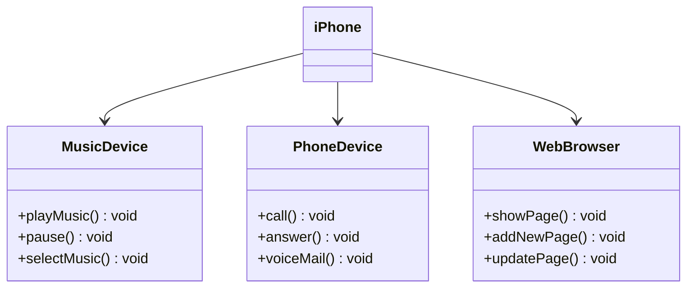

Métodos de funções do smartPhone

Criado um arquivo para implementação dos métodos do SmartPhone.

```mermaid

classDiagram
class MusicDevice {
+playMusic() void
+pause() void
+selectMusic() void
}

    class PhoneDevice {
        +call() void
        +answer() void
        +voiceMail() void
    }

    class WebBrowser {
        +showPage() void
        +addNewPage() void
        +updatePage() void
    }

    class iPhone {
    }

    iPhone --> MusicDevice
    iPhone --> PhoneDevice
    iPhone --> WebBrowser
```
